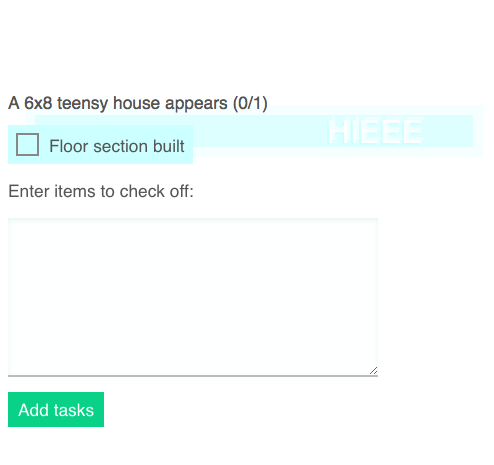

**scroll-to-select** puts a selector beam on a web page, and lights up elements with ids you provide.



HTML:

```html
<div id="one">ONE</div>
<div id="two">TWO</div>
<div id="three">THREE</div>
```

Javascript:

```javascript

scrollToSelect({
  ids: ["one", "two", "three"],
  onSelect: function(oneTwoOrThree) {
    // do your worst
  },
  text: "HIEEE"
})
```
